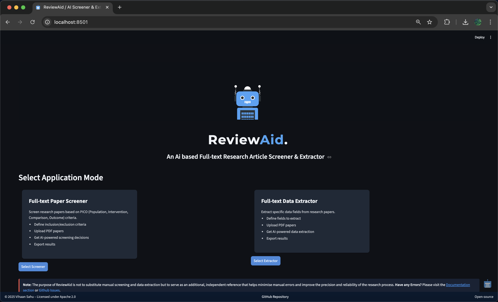
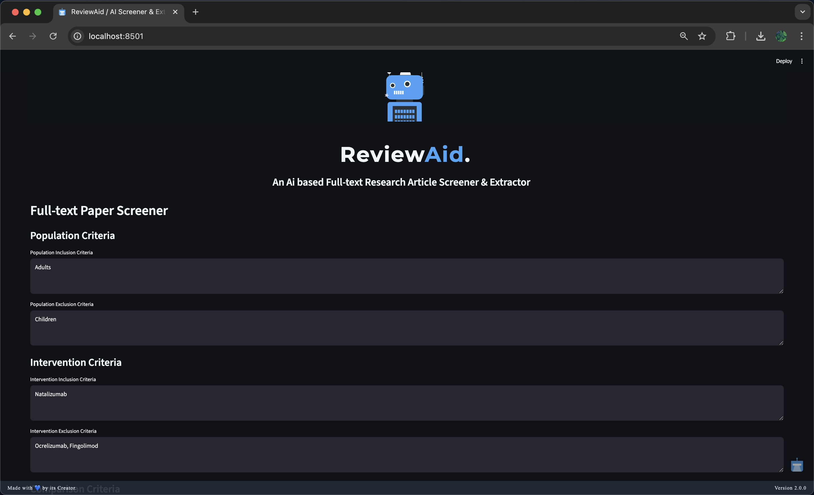
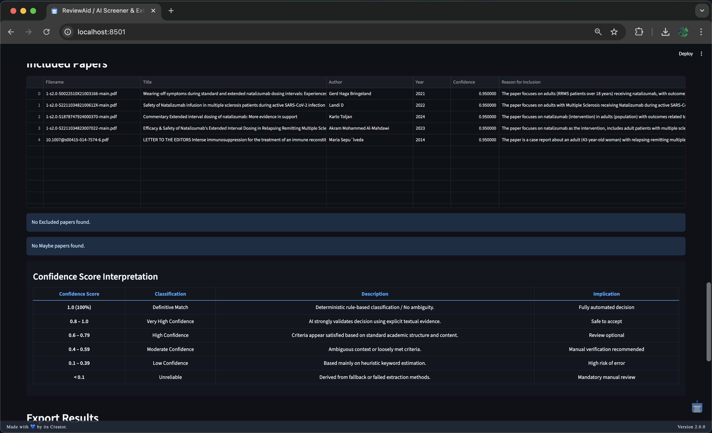
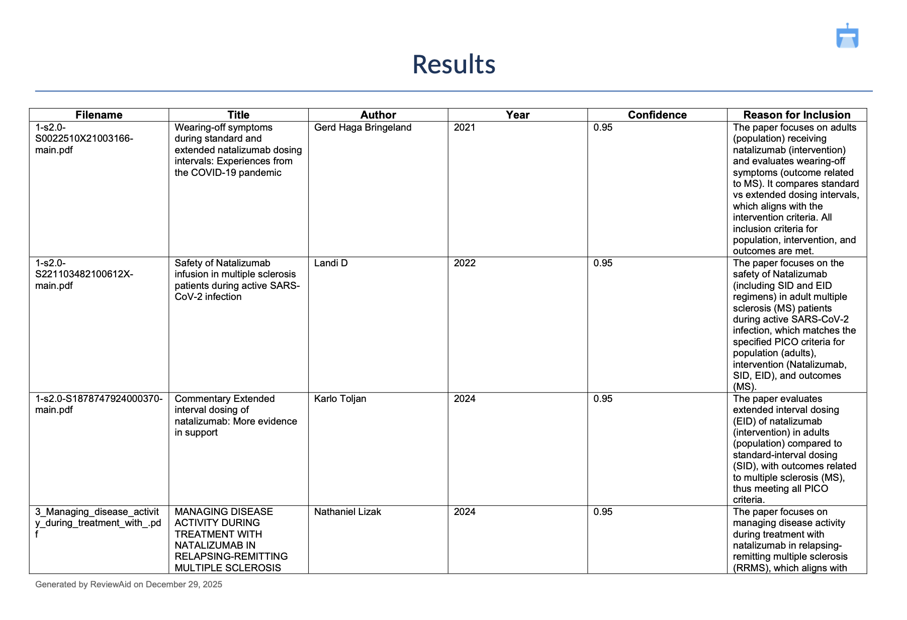
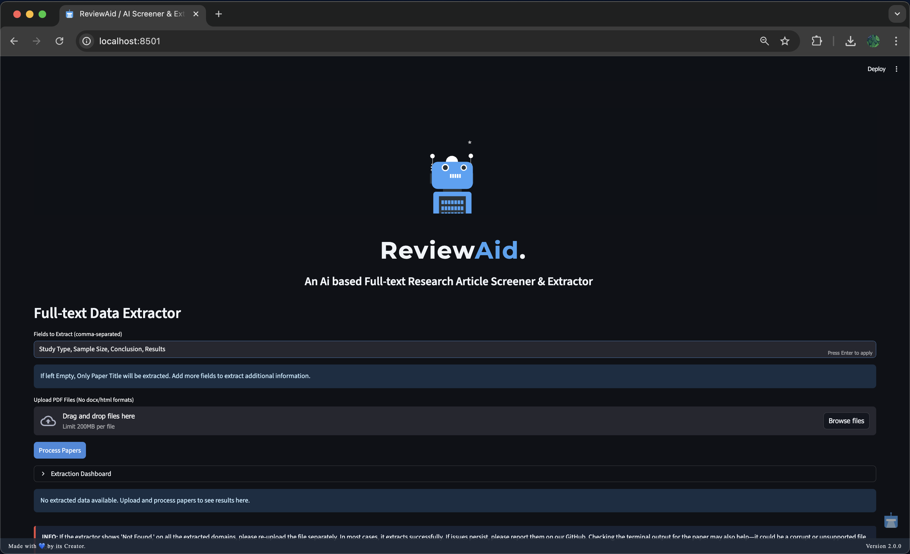
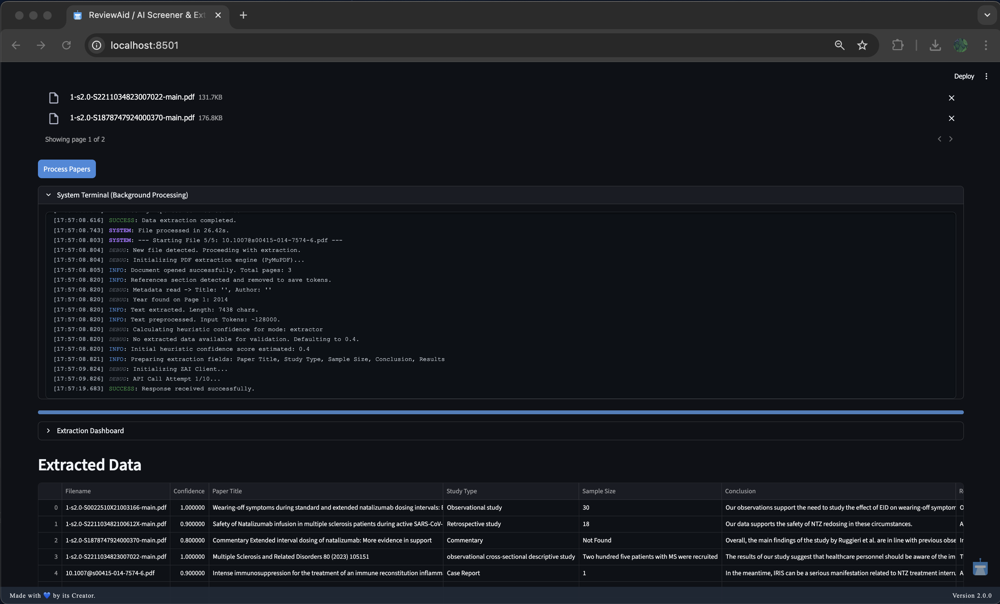
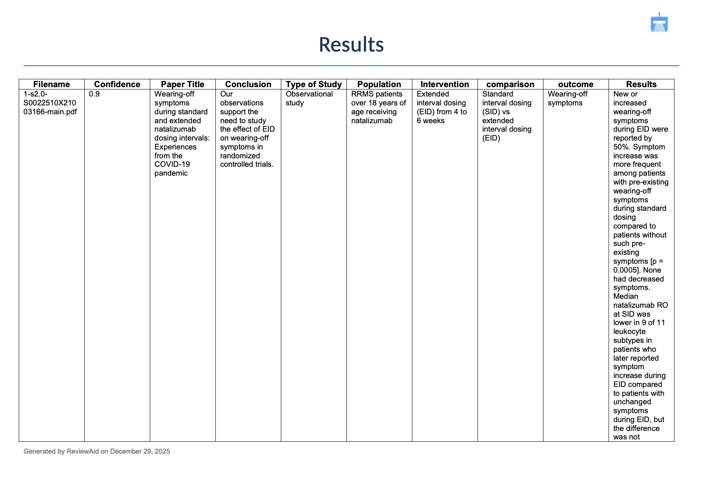
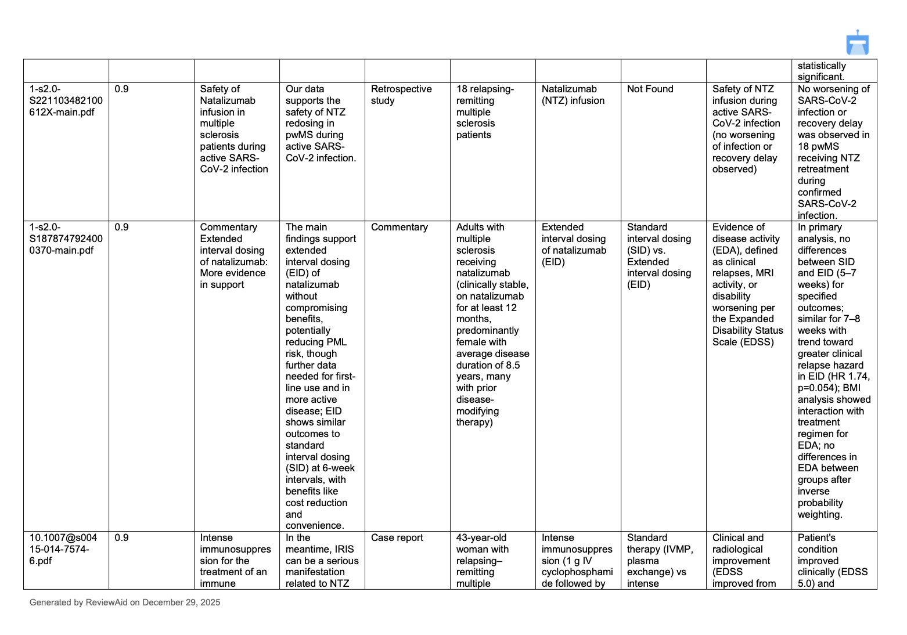

**Code & Archive (Zenodo DOI):** [10.5281/zenodo.18060972](https://doi.org/10.5281/zenodo.18060972)

**ReviewAid** is an AI-powered Research article full-text Screener and Extractor designed to streamline the systematic review process. Upload research papers, automatically screen for relevance, extract key data fields, and accelerate your literature review workflow — all in one intuitive, easy-to-use web tool.

---

##  Demo Video

Check out the full walkthrough and demonstration of ReviewAid on YouTube:

---

## 🚀 Features

- **AI-based full-text screening:** Quickly filter large batches of research articles based on your custom inclusion and exclusion criteria.  
- **Extraction:** Extract any part of the paper you want! 
- **Customizable data extraction:** Define exactly what data fields you want extracted, and let's AI do the heavy lifting.  
- **Bulk PDF upload & management:** Easily upload and organize hundreds of research articles in PDF format.
- **Clean, modern, and responsive UI:** Focus on your research without distractions thanks to a sleek interface built with Streamlit.  
- **Privacy-first approach:** Your uploaded documents and API keys stay private and are never stored or shared.  
- **Open-source and extensible:** Built on Python and Streamlit for easy customization and community contributions.  

- **NOTE ‼️:** 

1. ReviewAid is used as a supplementary tool alongside manual screening and data extraction to minimise errors and improve research accuracy, without replacing human judgment. 
  
2. Please restrict each submission to a maximum of **20 articles**. Submissions exceeding this limit will result in processing of only the first 20 articles, after which the process will **terminate** prematurely. Kindly adhere to this restriction. **Please respect this limit.**

---

## 📝 Important Notes

- **Performance:**  
  Depending on the number and size of PDFs uploaded and your internet connection, AI processing can take some time. Please be patient — progress indicators and termianl will keep you updated. 

- **Limitations:**  
  The web is hosted on Streamlit and hence users may face **cold starts** when the user has to wait **30 seconds** for the web to initialise. 
  As per tool usage, the developer may decide to host it on better sources to avoid such **cold starts**.

- **New Features:**  
  In future, as per demand, I might add a feature which will enable Researchers to use any Ai API they want with ReviewAid. Simply use your personal API key and use the tool. Fast, Private, Any AI.

---

## 🌟 Confidence Scoring System

This system implements a **hierarchical four-tier confidence model** designed to maximize precision and minimize false classifications during automated paper screening and data extraction. The logic prioritizes **deterministic rule-based decisions** before progressively falling back to algorithmic and heuristic estimation only when necessary.

## ❓ Overview

The confidence score reflects how reliably a paper has been classified or extracted. Scores range from **0.0 to 1.0**, where higher values indicate stronger certainty and lower values explicitly flag the need for manual review.

The system operates in the following order:

1. Deterministic Rule-Based Classification  (Screener specific)
2. LLM Self-Assessment  
3. Heuristic Keyword Estimation  
4. Low-Confidence Default  

Text: Tier 1 (Deterministic) 
→
 Tier 2 (LLM) 
→
 Tier 3 (Heuristic) 
→
 Tier 4 (Default).

Each tier is only activated if the previous tier fails to produce a valid and reliable result.

## ✔️ Tier 1: Deterministic Rule-Based Classification (Highest Priority) 

**Purpose:** Eliminate ambiguity using explicit user-defined rules. For screener, Extractor starts directly from Tier 2.

**Logic:**
- The system performs a preliminary scan for **exclusion** and **inclusion** keywords.
- If **exclusion keywords are detected without any corresponding inclusion keywords**, the paper is:
  - Automatically classified as **Excluded**
  - Assigned a **confidence score of 1.0 (100%)**
- If **both exclusion and inclusion keywords** are present:
  - This tier is **bypassed** to avoid false positives
  - The decision is delegated to the AI-based evaluation

**Rationale:**  
Explicit rules provide deterministic certainty and override probabilistic inference when applicable.

## ✔️ Tier 2: LLM Self-Assessment (Primary Mechanism)

**Purpose:** Leverage the model’s internal reasoning and evidence-based judgment.

**Logic:**
- The Large Language Model (LLM) is explicitly instructed to:
  - Evaluate its own screening or extraction decision
  - Assign a **confidence score between 0.0 and 1.0**
  - Base the score strictly on **explicit textual evidence**
- The confidence value is parsed directly from the model’s structured JSON output

**Rationale:**  
This tier captures nuanced contextual understanding that deterministic rules cannot, while maintaining transparency through self-reported certainty.

## ✔️ Tier 3: Heuristic Keyword Estimation (Fallback)

**Purpose:** Provide a probabilistic estimate when LLM confidence is unavailable.

**Triggered when:**
- The LLM fails to return a valid confidence value (e.g., formatting or JSON parsing errors)

**Screener Logic:**
- The system analyzes the users input **Inclusions and Exclusions critiera** and matches with the paper's full-text and determines the confidence level.

**Extractor Logic:**
- The system analyzes **Extracted data** with the paper's full-text and determines the confidence level.

**Rationale:**  
This tier offers a best-effort estimate derived from text structure rather than semantic certainty.

## ✔️ Tier 4: Low-Confidence Default (Last Resort)

**Purpose:** Explicitly flag unreliable outputs.

**Triggered when:**
- Data extraction fails entirely (e.g., Regex failure or missing sections)

**Logic:**
- Assigns a **baseline low confidence score** (e.g., `0.2`)
- Automatically flags the result for **mandatory manual review**

**Rationale:**  
Prevents silent failures by clearly signaling unreliability.

This layered approach ensures that high-confidence decisions are automated safely, while ambiguous or unreliable cases are clearly flagged for human oversight.

---

## ⭐ Confidence Score Interpretation

| Confidence Score | Classification | Description | Implication |
|------------------|---------------|-------------|-------------|
| **1.0 (100%)** | Definitive Match | Deterministic rule-based classification / No ambiguity. | Fully automated decision |
| **0.8 – 1.00** | Very High Confidence | AI strongly validates the decision using explicit textual evidence. | Safe to accept |
| **0.6 – 0.79** | High Confidence | Criteria appear satisfied based on standard academic structure and content. | Review optional |
| **0.4 – 0.59** | Moderate Confidence | Ambiguous context or loosely met criteria. | Manual verification recommended |
| **0.1 – 0.39** | Low Confidence | Based mainly on heuristic keyword estimation. | High risk of error |
| **< 0.1** | Unreliable | Derived from fallback or failed extraction methods. | Mandatory manual review |

---

## 📦 Bulletproof Parsing Pipeline

**Purpose:** Safely parse API/AI responses, even if the JSON is broken or missing.

### Flow

1. **If `raw_result` is `None`**
   → Use regex to extract data locally.

2. **Clean the response**
   → Remove Markdown, comments, and trailing commas.

3. **Try standard JSON parsing**
   → `json.loads`

4. **If that fails, try JSON5**
   → Handles loose / malformed JSON.

5. **If that fails, use AI repair**
   → Ask AI to fix the JSON.

6. **Final fallback**
   → Extract known keys using regex.

### Guarantee

* Never crashes
* Always attempts to recover usable data

---

## ⚡ Usage

1.  **Run the Streamlit web app**

2.  **Select Mode:**
    *   **Full-text Paper Screener:** Choose this mode to screen papers based on PICO (Population, Intervention, Comparison, Outcome) criteria.
    *   **Full-text Data Extractor:** Choose this mode to extract specific fields (Author, Year, Conclusion, etc.) from research papers.

3.  **Workflow (Screener):**
    *   Enter your PICO criteria (Inclusion/Exclusion) in the input fields.
    *   Upload your PDF papers (Batch upload supported).
    *   Click "Screen Papers".
    *   Monitor the "System Terminal" for real-time logs of extraction, API calls, and processing status.
    *   View the "Screening Dashboard" for a pie chart of Included/Excluded/Maybe decisions.
    *   Download results as CSV, XLSX, or DOCX.

4.  **Workflow (Extractor):**
    *   Enter the fields you want to extract (comma-separated).
    *   Upload your PDF papers.
    *   Click "Process Papers".
    *   Monitor the "System Terminal" for logs.
    *   View extracted data in the dashboard.
    *   Download extracted data as CSV, XLSX, or DOCX.

---

## 📸 Screenshots

### User Interface
  

### Screener
  

 

 

### Extractor
  

 

 

 

 

---

## 🔗 Acknowledgements

I gratefully acknowledge the developers of **GLM-4.6V-Flash (Z.ai)** for providing the AI model used in ReviewAid.  
The visual and text-based reasoning capabilities of GLM-4.6V-Flash have greatly enhanced ReviewAid's full-text screening and data extraction workflows.

For more information, please see the [GLM-4.6V-Flash paper](https://arxiv.org/abs/2507.01006) and [GLM-4.6V-Flash Hugging Face](https://huggingface.co/zai-org/GLM-4.6V-Flash).

I would also like to thank [@Nightraven5115](https://github.com/Nightraven5115) for his thorough validation of ReviewAid, including batch testing, error checks, and confidence verification, which significantly improved the tool’s reliability and accuracy.

---

## 📌 Citation

If you use ReviewAid, please cite:

**Sahu, V. (2025). ReviewAid: AI-Driven Full-Text Screening and Data Extraction for Systematic Reviews and Evidence Synthesis (v2.0.0). Zenodo.** DOI: [10.5281/zenodo.18060972](https://doi.org/10.5281/zenodo.18060972)

---

## 📄 License

This project is licensed under the Apache 2.0 License.

---

## 📨 Contact

Questions, feedback, or collaboration ideas? Reach out at [pteroisvolitans12@gmail.com](mailto:pteroisvolitans12@gmail.com) or open an issue on GitHub.

Contributions are always welcome!

---

*Happy reviewing! :))*

