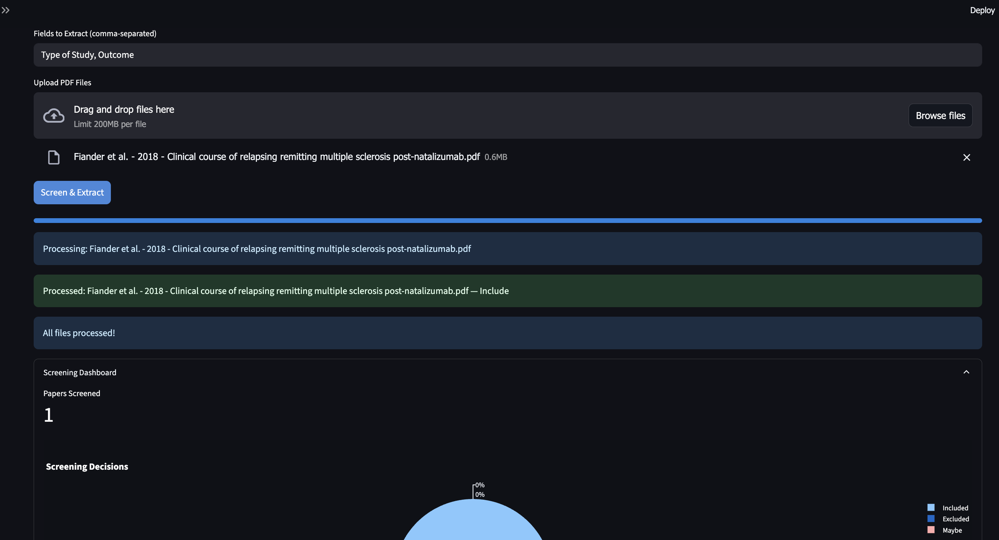
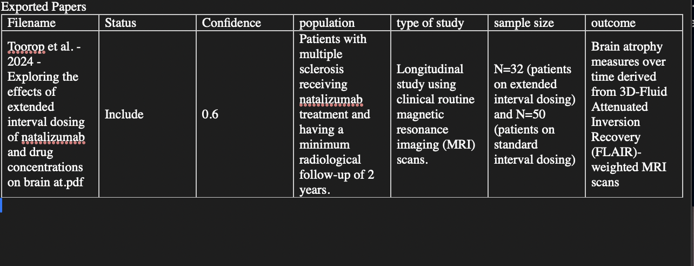

# ReviewAid

**ReviewAid** is an AI-powered Research article full-text Screener and Extractor designed to streamline the systematic review process. Upload research papers, automatically screen for relevance, extract key data fields, and accelerate your literature review workflow — all in one intuitive, easy-to-use web tool.

---

## 🚀 Features

- **AI-based full-text screening:** Quickly filter large batches of research articles based on your custom inclusion and exclusion criteria.  
- **Extraction:** Extract any part of the paper you want! 
- **Customizable data extraction:** Define exactly what data fields you want extracted, and let the AI do the heavy lifting.  
- **Bulk PDF upload & management:** Easily upload and organize hundreds of research articles in PDF format.
- **Clean, modern, and responsive UI:** Focus on your research without distractions thanks to a sleek interface built with Streamlit.  
- **Privacy-first approach:** Your uploaded documents and API keys stay private and are never stored or shared.  
- **Open-source and extensible:** Built on Python and Streamlit for easy customization and community contributions.  

---

## 📝 Important Notes

- **Performance:**  
  Depending on the number and size of PDFs uploaded and your internet connection, AI processing can take some time. Please be patient — progress indicators will keep you updated. 

- **Use:**  
   A maximum of 20 papers can be uploaded at a single time.

- **Use:**  
  The web is hosted on Render and hence users may face **cold starts** wherin the user has to wait **30 seconds** for the web to initialise. 
  As per tool usage, the developer may decide to host it on better sources to avoid such **cold starts**.

   

---

📄 License
This project is licensed under the AGPL-3.0 License.

---

📬 Contact
Questions, feedback, or collaboration ideas? Reach out at [aurumzgg@hotmail.com] or open an issue on GitHub.
Contributions are always welcome!

---

Upload your PDFs, enter your screening criteria, and start your review! 
Happy reviewing! :))

---

## 📸 Screenshots

  
*User Interface.*

  
*Upload pdfs to Screen & Extract.*

  
*Extracted results (example), Can be downloaded in the available formats.*

